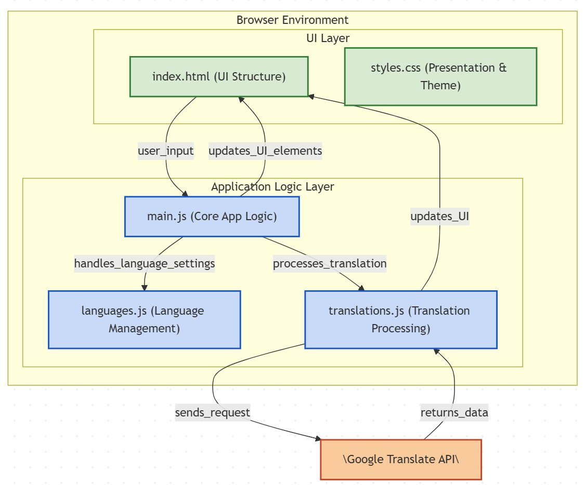

# PolyglotSync - Bilingual Book Generator

 ## [**Live Website**](https://julius-gun.github.io/PolyglotSync_Google_Translate_Book_Generator/)

Generate bilingual (or multilingual) books side-by-side from your source text using Google Translate.

## Features

*   Translate text into up to 4 target languages simultaneously.
*   Supports a wide range of languages.
*   Customizable UI language.
*   Displays source and translated paragraphs side-by-side.
*   Progress bar with ETA for translation.
*   Option to view the generated book in a clean "Book View".
*   Save the generated book as an EPUB file.
*   Light/Dark theme toggle.

## How to Use

1.  Visit the [Live Website](https://julius-gun.github.io/PolyglotSync_Google_Translate_Book_Generator/).
2.  (Optional) Select your preferred UI language using the dropdown at the top right.
3.  Select the source language of your text (or leave it as "Autodetect Language").
4.  Select your desired target language(s) using the dropdowns. Click the "+" button to add more target languages (up to 4).
5.  Paste or type your source text into the text area.
6.  Click the "Generate Book" button.
7.  Wait for the translation process to complete (monitor the progress bar).
8.  Once finished, you can:
    *   Read the book directly on the page.
    *   Click "Open in Book-View" for a cleaner reading experience in a new tab.
    *   Click "Save as EPUB" to download the book in EPUB format.
    *   Click "Reload Page" to start over.

## How it Works

This tool splits the source text into sentences, merges short ones, and sends them in batches to the Google Translate API (`translate.googleapis.com`) for translation. The results are then displayed paragraph by paragraph in a multi-column layout. It uses client-side JavaScript, HTML, and CSS.

## Credits

This project is a fork of the original [bilingual-books](https://github.com/Lachy-Dauth/bilingual-books) repository repository.
